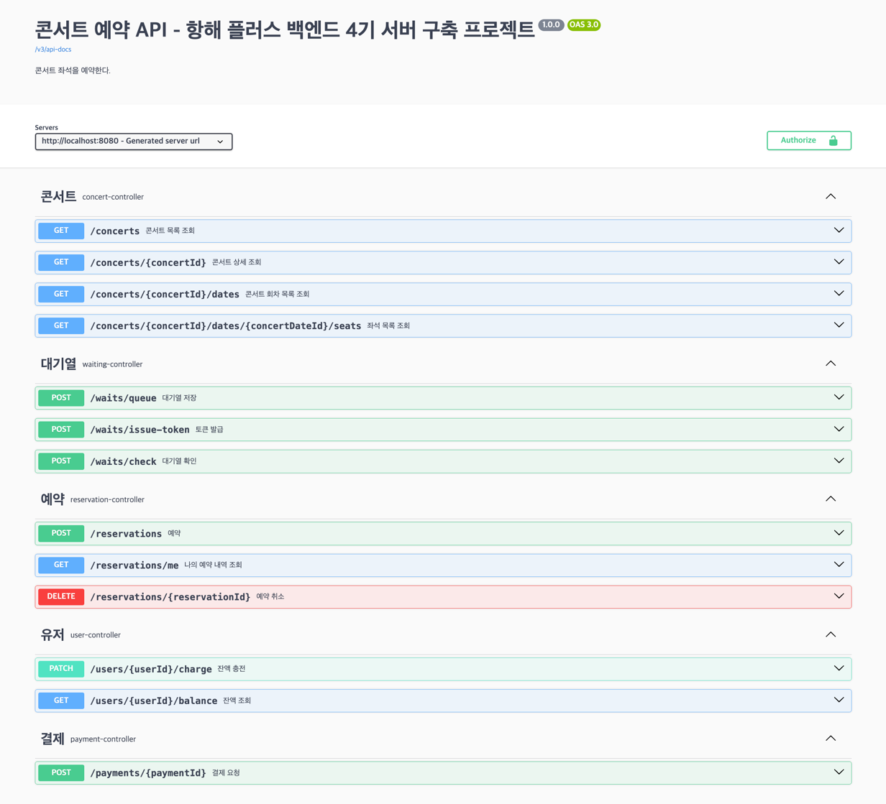

# hhplus03_server

# [항해 플러스 백엔드 3주차] 서버 구축
### *시나리오 - 콘서트 예약 서비스*
---
## 1. 요구사항 분석
### 프로젝트 Milestone & 요구사항 명세서 & API 명세서
[구글닥스 문서 바로가기](https://docs.google.com/spreadsheets/d/1xUItBPr_C1zbzSHNcl8WOv9zL6cymvzz5DRU_7oKDZM/edit#gid=983380097)
### Swagger UI
[Swagger UI](http://localhost:8080/swagger-ui/index.html#/)

### UML 다이어그램
*변경된 로직이 있어 추후 수정 예정입니다.*

### ERD 명세

---
### Dummy data - postman 호출
- API: http://localhost:8080/concerts/
  

---
## 2. 작업 내용
3주차
- ~2024.04.02
  - 요구사항 분석
  - 프로젝트 명세 문서 작성
  - ERD 설계
  - 프로젝트 세팅
- 2024.04.03
  - 아키텍처 구조 설계
  - Mock API 작성 중
- 2024.04.04
  - ERD 재설계
  - Mock API 작성
  - Dummy Data 반환 및 http 테스트
  - SecurityConfiguration 작성 (postman 테스트용)
  
4주차
- ~2024.04.09
  - swagger UI
  - 기본 api 명세 인터페이스 구현
- 2024.04.10
  - 기본 기능 api 서비스 로직 구현
  - 단위테스트 작성
- 2024.04.11
  - 대기열 서비스 로직 구현
  - 단위테스트 작성
  
5주차
- ~2024.04.18
  - 테이블 재설계: 도메인 어그리게이트 별로 분리하여 재설계
  - 통합테스트 작성
  - 대기열 기능 고도화

---
# 3. Trouble Shooting
*모든 과정을 기록할 수는 없었지만, 5주차 진행 과정에서의 나의 트러블 슈팅 과정을 기록하였다.*

[Trouble Shooting 기록 바로가기](https://iwannabarmus.tistory.com/27)

---
# 4. 개발하면서 끄적
## 3주차 인사이트
- 요구사항을 api 명세로 녹여내고, 기능 구현 흐름을 작성해보는 것
- DB를 적절한 정규화 방식으로 설계하는 것
- 테이블도 결국 캡슐화? 의존성을 줄여..
## 4주차 인사이트
- 대기열 구현 시 생각해볼 것들
## 5주차 인사이트
- jpa 설계 원칙대로 객체지향을 살리면서 객체로 연관짓는 것과, 유연성을 살리고 강결합을 막으며 pk만 들고 있는 것의 차이
  - 도메인 애그리거트? 애그리거트 루트?
  - 도메인 애그리거트를 잘 생각해서 의존성을 분리시키자
- 결국 서비스는 핵심 기능이 얼마나 잘 돌아가는지가 중요하다.
  - 핵심 기능이 본인의 역할의 책임을 다 할 수 있도록 도메인 기능을 잘 분리하여 설계하자.
  - 모든 것을 다 갖춘 설계는 없다. 각 장단점이 있다. 내가 해야 할 것은 어디에 집중할 지 스스로 선택하는 것
  - 여러 가지를 모두 구현해보며 나만의 기준과 나의 스타일을 찾자.

---
## 기술 스택 결정
- Spring boot
- Jpa
- Mysql

## 테스트 시나리오
- 테스트 코드 주석 참고

