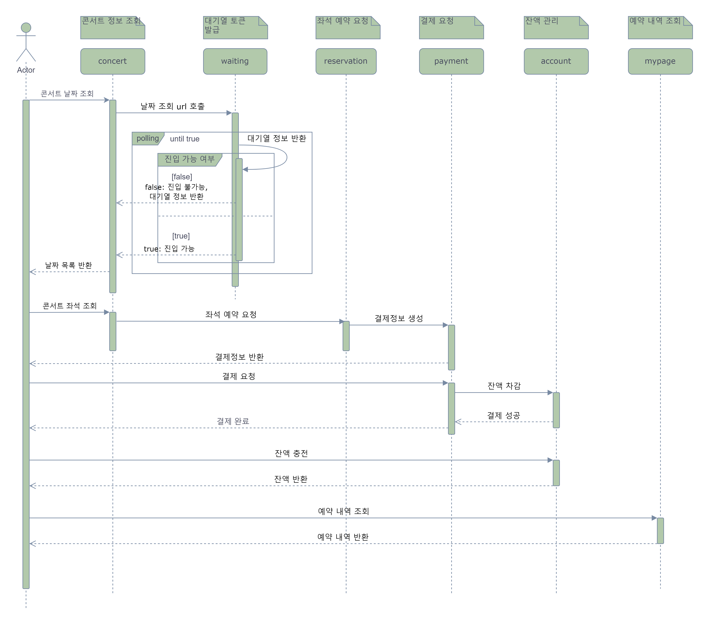
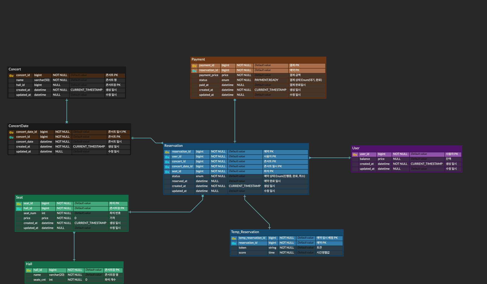

# hhplus03_server

## [항해 플러스 백엔드 3주차] 서버 구축
#### *시나리오 - 콘서트 예약 서비스*

### 1. 요구사항 분석
#### 프로젝트 Milestone & 요구사항 명세서 & API 명세서
[구글닥스 문서 바로가기](https://docs.google.com/spreadsheets/d/1xUItBPr_C1zbzSHNcl8WOv9zL6cymvzz5DRU_7oKDZM/edit#gid=983380097)
#### UML 다이어그램

#### ERD 명세
*※대기열 구현에 필요한 테이블은 대기열 구현 시 작성 예정*

### 2. 작업 내용
- ~2024.04.02
  - 요구사항 분석
  - 프로젝트 명세 문서 작성
  - ERD 설계
  - 프로젝트 세팅
- 2024.04.03
  - 아키텍처 구조 설계
  - Mock API 작성 중
- 2024.04.04
  - ERD 재설계
  - Mock API 작성
  - Dummy Data 반환 및 테스트

### 3주차 인사이트

### 기술 스택 결정
- Spring boot
- Jpa
- Mysql

### 테스트 시나리오
- 테스트 코드 주석 참고

