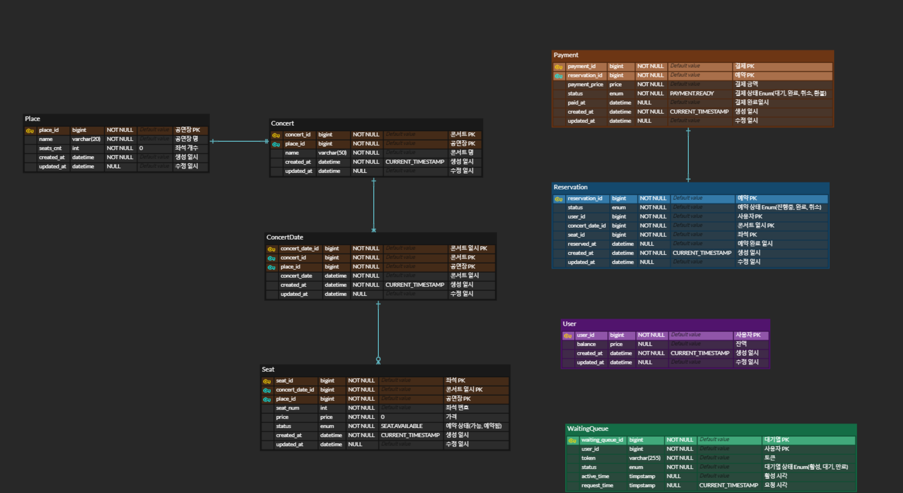
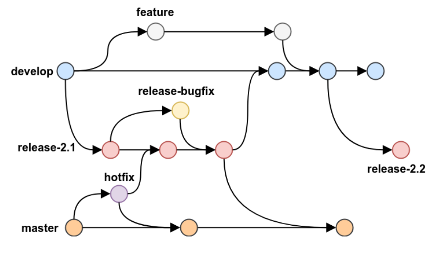

# hhplus03_server

# [항해 플러스 백엔드 3주차] 서버 구축
### *시나리오 - 콘서트 예약 서비스*

### 목차

- [1. 요구사항 분석](##one)
- [2. 브랜치 전략과 버전 관리](##two)
- [3. 동시성 제어 처리 로직 비교 구현]()
- [4. DB Index 사용과 비교]()
- [Trouble Shooting](##4.-Trouble-Shooting)
- [개발하면서 끄적](##5.-개발하면서-끄적)
- [기술 스택](##6.-기술-스택)

---
<h2 id="one">1. 요구사항 분석</h2>

### 프로젝트 Milestone & 요구사항 명세서 & API 명세서
[구글닥스 문서 바로가기](https://docs.google.com/spreadsheets/d/1xUItBPr_C1zbzSHNcl8WOv9zL6cymvzz5DRU_7oKDZM/edit#gid=983380097)
### Swagger UI
[Swagger UI](http://localhost:8080/swagger-ui/index.html#/)

### UML 다이어그램
*변경된 로직이 있어 추후 수정 예정입니다.*

### ERD 명세

---
### Dummy data - postman 호출
- API: http://localhost:8080/concerts/
  

---
<h2 id="two">2. 브랜치 전략과 버전 관리</h2>

### 브랜치 전략
- Git-flow 기반
- 환경
  - dev → sta → prod
  #### **dev : 개발 환경**
    - 개발자들이 각자 개발한 내용들을 합친 뒤 테스트 하는 환경
    - 개발자는 feature/xx (기능 개발, 변경) 브랜치를 따서 local 환경에서 개발하고 자체 테스트를 진행한다.
    - 개발자들이 pull request를 통해 dev 브랜치로 merge한다.
    - dev 브랜치로 merge되면 자동적으로 dev 환경에 배포되고, 해당 feature 브랜치는 제거된다.
  #### **sta: 스테이징 환경**
    - 다음 버전의 코드로 운영 환경과 거의 동일한 환경을 만들어 릴리즈 전에 테스트하는 환경
    - release 브랜치가 테스트 됨
    - 운영 환경으로 이전하기 전에, 여러 가지 비 기능적인 부분 (보안, 성능, 장애 등)을 검증하는 환경
  #### **prod: 운영 환경**
    - 실제 서비스를 위한 환경
    - 릴리즈 계획이 없다면 수정되지 않아야 한다.
    - release 브랜치로 배포하고, 배포가 정상적으로 이루어졌을 시 master 브랜치로 merge한다.
  #### 운영 방안
    - CI Step을 구성하여 통과 시 merge, 배포된다.
      - checkout → build → test → lint → report
      - 코드 정적 분석(lint)은 checkstyle tool 사용하여 진행
    - phase 별로 서로 다른 파이프라인을 가진다.  

- 브랜치
  - 크게 5개의 브랜치로 운영하여 관리한다.
    - 메인 브랜치: master, develop
      - master: 실제 제품으로 배포 및 출시되는 브랜치
      - develop: 다음 출시 버전을 기다리는 브랜치
    - 보조 브랜치: feature, release, hotfix
      - feature: 기능을 개발, 수정하는 브랜치. 개발이 완료되어 머지되면 삭제한다.
      - release: 이번 출시 버전을 준비하는 브랜치
      - hotfix: 출시 버전에서 발생한 버그를 긴급 수정하는 브랜치. 수정이 완료되면 삭제한다.

### CI/CD 전략
- develop, release 브랜치에 push, pull-request 될 경우
  - CI
    - test 수행 (Jacoco를 이용한 코드 커버리지 보고서 생성)
    - lint 수행 (Checkstyle을 통한 코드 스타일 검사)
    - build 수행
  - 개발 환경으로의 간단한 이미지 빌드 및 푸시 프로세스
- main 브랜치에 push 될 경우
  - 프로덕션 환경으로의 복잡한 배포 프로세스

### 버전 관리
- Semantic versioning 을 활용하여 버전 번호를 관리한다.
  - Major.Minor.Patch

#### Major Version

- 이전 버전과 호환되지 않는 API 변경
- 양수만 사용 가능
- 증가할 경우 Minor, Patch 버전은 0으로 초기화

#### Minor Version

- 이전 버전과 호환되는 방식으로 새 기능 추가
- 일부 기능에 대한 제거 예고
- 양수만 사용 가능
- 증가할 경우 Patch 버전은 0으로 초기화

#### Patch Version

- 이전 버전과 호환되는 방식으로 버그 등 수정
- 양수만 사용 가능

#### Build Version

- 필요 시 사용
- ‘+’ 기호 뒤에 build 버전 표기.
- 숫자 및 알파벳 대소문자 사용 가능.
- 동일 Patch Version보다 높은 우선 순위를 가진다.
- ex) `1.0.0+1201.0.0+exp.sha.5111.0.0-alpha.1+build120`

#### 배포 환경에서의 버전 관리
이번 서비스에서의 배포 환경은 dev, staging, prod 로 두었다.  
각 환경마다 Versioning을 다르게 적용한다고 하였을 때,  
build_number값을 활용하여 Build Version을 체크한다.  
(브랜치 이름 활용 시 Semantic Versioning의 명명 규칙에 어긋나는 경우 발생 가능)
- dev
  - `1.0.0+dev.{build_numer}`
- staging
  - `1.0.0+staging.{build_number}`
- prod
  - `1.0.1`

---
## 3. 동시성 제어 처리 로직 비교 구현
[콘서트 예약 서비스에서 발생할 수 있는 동시성 이슈와 처리 방안](https://iwannabarmus.tistory.com/30)

---
## 4. DB Index 사용과 비교
[성능 향상을 위한 DB Index 사용과 비교](https://iwannabarmus.tistory.com/36)

---
## 5. 대기열 설계 및 구현
0. 상황
- 콘서트 조회, 콘서트 날짜 조회 api는 대기열 X
- 콘서트 날짜를 선택하여 [예매하기] 버튼을 눌러 콘서트 좌석 조회 api 호출하는데,
  해당 좌석 조회 api에 대기열을 붙인다.

1. api 목록
- 대기열 토큰 발급
  - POST /token
    - request : userId
    - response : token, isActive, waitingInfo(대기순서, 잔여 시간)
- 대기열 토큰 활성여부 조회
  - GET /token
    - request: token
    - response : token, isActive, waitingInfo(대기순서, 잔여 시간)
    - 반환된 isActive값이 true일 때까지 클라이언트에서 5초마다 polling 방식으로 호출하며,
      반환된 isActive값이 true면 페이지에 진입한다.
- 페이지에 진입시, Header에 token을 넣어 관리한다.

2. 대기열 토큰 구현
- 대기열 토큰은 Redis를 활용하여 관리한다.
- API 당 대기열 기능을 붙일 수 있다.
- 해당 API 호출의 작업이 완료되거나 기한이 만료된 토큰은 삭제로 관리한다.
- 대기열 토큰은 두 가지 상태를 가진다. 
  - waiting
    - sorted set 자료구조로 저장 (key: token/ score: 요청시간/ member: 유저 정보)
  - active
    - set 자료구조로 저장 (key: token/ member: 유저 정보, 만료 일시)
    - 작업이 완료되거나 만료 일시가 지나면 삭제 처리

3. Active tokens 전환 방식
- N초마다 M개의 토큰을 Active tokens로 전환하는 방식 선택
  : 대기열이 필요한 이유는 대규모 트래픽이 한번에 서비스로 유입되는 것을 방지하기 위함이므로,
  정확한 유저 수를 일정하게 유지하기보다는 사용자에게 제공한 대기 잔여 시간을 일관성 있게 보장하여
  사용자의 경험에 대한 만족도를 주는 것이 서비스 목적에 더 적합하다고 판단하였다.

4. 동시 접속자와 대기열 잔여 시간 계산 방식
- 한 유저가 콘서트 예약 사이클을 완료하는 데 걸리는 예상 시간
  - 1분
- DB에 동시에 접근할 수 있는 트래픽의 최대치를 계산
  - 약 100 TPS(초당 트랜잭션 수) ⇒ 1분당 6,000
- 콘서트 예약 사이클 동안 호출하는 api
  - 2(콘서트 좌석 조회 api, 좌석 예약 api) * 1.5(동시성 이슈에 의해 예약에 실패하는 케이스를 위한 재시도 계수(예측치)) = 3
- 분당 처리할 수 있는 동시접속자 수 = 2,000명
  - 10초마다 300명씩 유효한 토큰으로 전환
  - 전환되는 인원수로 대기열 순번 계산

---
## 작업 내용
3주차
- ~2024.04.02
  - 요구사항 분석
  - 프로젝트 명세 문서 작성
  - ERD 설계
  - 프로젝트 세팅
- 2024.04.03
  - 아키텍처 구조 설계
  - Mock API 작성 중
- 2024.04.04
  - ERD 재설계
  - Mock API 작성
  - Dummy Data 반환 및 http 테스트
  - SecurityConfiguration 작성 (postman 테스트용)
  
4주차
- ~2024.04.09
  - swagger UI
  - 기본 api 명세 인터페이스 구현
- 2024.04.10
  - 기본 기능 api 서비스 로직 구현
  - 단위테스트 작성
- 2024.04.11
  - 대기열 서비스 로직 구현
  - 단위테스트 작성
  
5주차
- ~2024.04.18
  - 테이블 재설계: 도메인 어그리게이트 별로 분리하여 재설계
  - 통합테스트 작성
  - 대기열 기능 고도화

6주차
- 2024.04.24
  - 브랜치 전략 수립

7주차
- 2024.05.02
  - 동시성 제어 처리 방식 구현, 비교 정리

8주차
- 2024.05.09
  - Index 사용과 성능 비교
  - 대기열 설계, 구현 (Redis)

---
## Trouble Shooting
*모든 과정을 기록할 수는 없었지만, 5주차 진행 과정에서의 나의 트러블 슈팅 과정을 기록하였다.*

[Trouble Shooting 기록 바로가기](https://iwannabarmus.tistory.com/27)

---
## 개발하면서 끄적
### 3주차 인사이트
- 요구사항을 api 명세로 녹여내고, 기능 구현 흐름을 작성해보는 것
- DB를 적절한 정규화 방식으로 설계하는 것
- 테이블도 결국 캡슐화? 의존성을 줄여..
### 4주차 인사이트
- 대기열 구현 시 생각해볼 것들
### 5주차 인사이트
- jpa 설계 원칙대로 객체지향을 살리면서 객체로 연관짓는 것과, 유연성을 살리고 강결합을 막으며 pk만 들고 있는 것의 차이
  - 도메인 애그리거트? 애그리거트 루트?
  - 도메인 애그리거트를 잘 생각해서 의존성을 분리시키자
- 결국 서비스는 핵심 기능이 얼마나 잘 돌아가는지가 중요하다.
  - 핵심 기능이 본인의 역할의 책임을 다 할 수 있도록 도메인 기능을 잘 분리하여 설계하자.
  - 모든 것을 다 갖춘 설계는 없다. 각 장단점이 있다. 내가 해야 할 것은 어디에 집중할 지 스스로 선택하는 것
  - 여러 가지를 모두 구현해보며 나만의 기준과 나의 스타일을 찾자.
### 7주차 인사이드
- 동시성 처리하며, 역시 케이스 바이 케이스
### 8주차 인사이트
- 인덱스 사용도 상황을 고려해서
- 인덱스 좋다.

---
## 기술 스택
- Spring boot
- Jpa
- Mysql

## 테스트 시나리오
- 테스트 코드 주석 참고

